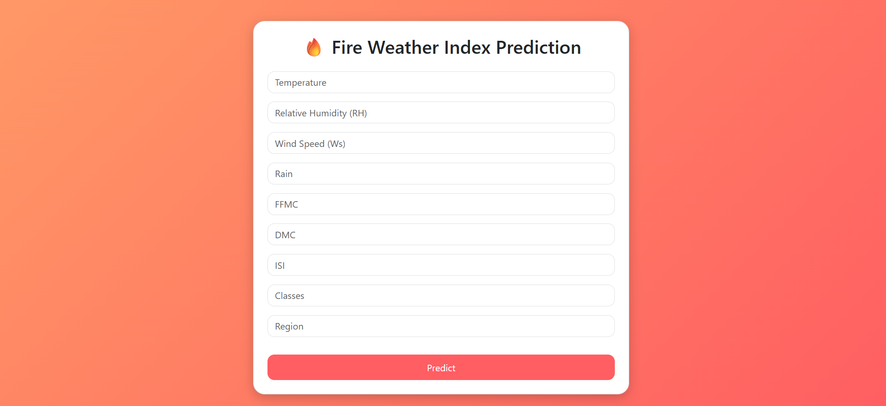

# 🔥 Forest Fire Weather Index Prediction

This project predicts the **Fire Weather Index (FWI)** using meteorological features with different regression models.  
The goal is to build a machine learning model that can accurately estimate FWI values, which are critical for wildfire risk management and prevention.

---

## 📂 Dataset

- The dataset contains weather-related attributes such as:
  - Temperature
  - Relative Humidity
  - Wind Speed
  - Rainfall
  - Other fire-related indices
- **Target variable**: `FWI` (Fire Weather Index)

---
## 🛠️ Tech Stack
- **Frontend:** HTML, CSS, Javascript (Bootstrap) 
- **Backend:** Python (Flask)    
---

## 🚀 Project Workflow

1. **Data Preprocessing**
   - Handled missing values (if any)
   - Normalized the data using `StandardScaler`

2. **Feature & Target Separation**
   - `X` → Independent features  
   - `y` → Target (`FWI`)

3. **Train-Test Split**
   - Split dataset into **80% training** and **20% testing**

4. **Model Training**
   - Trained and evaluated multiple regression models:
     - Linear Regression
     - Ridge Regression
     - Lasso Regression
     - ElasticNet Regression

5. **Evaluation Metrics**
   - MAE (Mean Absolute Error)
   - MSE (Mean Squared Error)
   - RMSE (Root Mean Squared Error)
   - R² Score (Accuracy indicator for regression)

---

## 📊 Model Performance

| Model              | MAE   | R² Score |
|--------------------|-------|----------|
| Linear Regression  | 1.13  | 0.949     |
| Ridge Regression   | 0.56  | 0.984  ✅ |
| Lasso Regression   | 0.61  | 0.982     |
| ElasticNet         | 0.65  | 0.981     |

*(values taken from your notebook results; may vary slightly on reruns)*

---

## 🏆 Final Result

- Among all models, **Lasso Regression (α=0.001)** performed the best with an **R² Score of 0.93**.
- This means the model explains **93% of the variance** in FWI values.
- ✅ **Final Chosen Model: Lasso Regression**

---

## ⚙️ How to Run the Project

1. **Clone the repository**
   ```bash
   git clone https://github.com/your-username/forest-fire-fwi-prediction.git
   cd forest-fire-fwi-prediction
   ```

2. **Create a virtual environment (recommended)**

   ```bash
   python -m venv venv
   source venv/bin/activate   # Linux/Mac
   venv\Scripts\activate      # Windows
   ```
3. **Install dependencies**

   ```bash
   pip install -r requirements.txt
   ```

4. **Run the application**

   ```bash
   application.py
   ```

---

## 🔮 Future Improvements

- Try advanced models like **Random Forest Regressor, XGBoost, or Gradient Boosting** for potentially better performance.
- Perform **hyperparameter tuning** for Ridge, Lasso, and ElasticNet.
- Use **cross-validation** to reduce overfitting and get more robust results.

---

## 🖼️ Screenshots

### 🔹 Home Page


### 🔹 Prediction Result


---